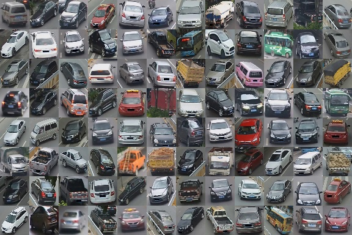
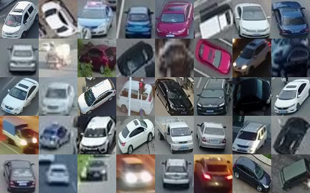

# 🚗 Train ReID model for Vehicle Tracking with UAV

## 📂 Datasets

There is no off-the-shelf dataset perfectly suited for this ReID task, so this project uses two datasets:

### 1. VeRi Vehicle Re-Identification Dataset

- 🔗 [GitHub Source](https://github.com/JDAI-CV/VeRidataset)
- ⚠️ Non-commercial use only.
- 📥 Alternate download available on [Kaggle](https://www.kaggle.com/datasets/abhyudaya12/veri-vehicle-re-identification-dataset).
- 🛠️ Preprocessing: run `prepare/veri.py` to format it for PyTorch training.

<p align="center">
  
</p>

---

### 2. VisDrone-ReID (Custom Dataset)

To adapt the model for use in **VisDrone-MOT** and **UAVDT-MOT**, we created a simplified custom dataset, **VisDrone-ReID**, based on **VisDrone-MOT**.

- 🔗 [Download VisDrone-ReID from Kaggle](https://www.kaggle.com/datasets/foryolotrain1/visdrone-reid)
- 📝 This dataset is simple but effective for ReID-based appearance models in multi-object tracking vehicles.

<p align="center">
  
</p>


---

## 🗂️ ReID Dataset Structure

The dataset should follow this folder structure:

```
pytorch/
├── train/
├── query/
└── gallery/
```

- `train/`: Training images with unique identities.
- `query/`: Test images from unseen identities used to evaluate retrieval performance.
- `gallery/`: A set of images from the same identities as `query/`, used for matching.

📌 **Note**: There is **no identity overlap** between `train`, `query`, and `gallery`.

---

## 🚀 Training Process

1. **Stage 1**: Train the model using the **VeRi** dataset.
2. **Stage 2**: Fine-tune or re-train using **VisDrone-ReID** for better domain-specific performance.

---

## 🧠 Model Configuration & Training

Navigate to the model directory:

```bash
cd YoloSeries-Tracking/trackers/reid_models
```

Prepare `cfg/config.yaml` like this:

```yaml
train_batch_size: 64
test_batch_size: 256
net: deepsort-reid   # name of model
data_dir: /path/to/your/dataset/pytorch
camera_id: False    # set True if training on VeRi dataset, False if training on VisDrone-ReID
image_shape: [128, 64]  # image shape
feature_dim: 128  # feature dimension
device: 0
resume: false
epochs: 5
save_folder: deepsort-reid-custom-dataset
optim: Adam
lr: 0.0003
scheduler: cosine
optim: Adam
pretrained_weight: null
pretrained: False
metric_loss: null # or 'triplet' - add TripletMarginLoss to compute loss function

```

### 🏋️‍♂️ Train the Model

```bash
python train.py --cfg path/to/config/file.yml
```

### 📊 Test and Evaluate

```bash
python test.py --cfg path/to/config/file.yml
```

## 🔗 References

https://github.com/JDAI-CV/VeRidataset

https://github.com/layumi/Person_reID_baseline_pytorch

https://github.com/TongJiL/Vehicle-Re-identification-on-VeRi-dataset

https://github.com/JDAI-CV/fast-reid